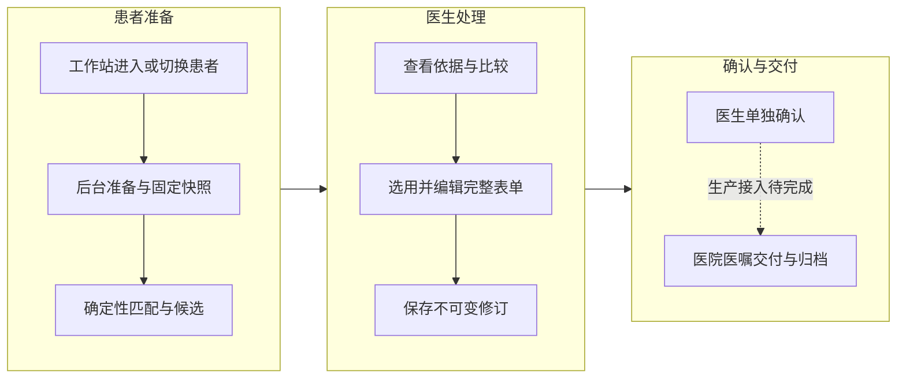

# 化疗智能体患者工作台

面向医生的化疗方案辅助工作台，与院内工作站集成：进入患者时提前准备资料和方案候选，医生查看依据、编辑完整方案表单、保存修订并单独确认。系统保留患者数据来源、方案与证据版本、医生操作和接口调用记录。

规则匹配、候选排序、剂量参考计算和数据写入由业务程序执行；主 Agent 提供有来源的解释，独立 Reviewer 检查指定修订。医生确认与医院医嘱提交是两个独立动作。

## 产品流程



当前实现范围、外部接入状态和未完成项统一维护在 [产品状态](docs/status.md)。本仓库尚未完成生产身份、真实医院交付及模型服务的完整联通验收；测试通过和医生确认均不代表临床发布。

## 系统组成

| 组件 | 技术与职责 | 代码入口 |
| --- | --- | --- |
| 医生页面与挂件 | React、TypeScript、Vite；宿主上下文、候选、表单和修订交互 | [frontend/src](frontend/src/)、[chemo-widget.js](frontend/public/chemo-widget.js) |
| 业务 API | FastAPI、Pydantic；身份范围、合同、幂等和业务事务 | [api.py](backend/src/chemo_agent_product/entrypoints/api.py)、[workflow.py](backend/src/chemo_agent_product/modules/clinical_context/workflow.py) |
| 后台任务 | API 进程内的异步 Worker；PostgreSQL 队列、租约、恢复和旧任务隔离 | [worker.py](backend/src/chemo_agent_product/agent_runtime/worker.py) |
| 数据与知识 | PostgreSQL；方案版本、证据、快照、患者修订和审计 | [数据模型](docs/data-model.md)、[增量迁移](backend/migrations/) |
| 模型与院方适配 | Claude Agent SDK、只读 MCP、HTTP 读取及交付合同 | [接入说明](docs/integrations.md) |

## 仓库结构

```text
backend/src/chemo_agent_product/
├── entrypoints/       # 应用与维护命令入口
├── core/              # 配置、认证、公共合同、幂等与 HTTP 支持
├── modules/           # 患者上下文、方案、推荐、患者方案、知识、管理
├── agent_runtime/     # Agent、只读工具、运行提示词与后台任务
├── integrations/      # 医院与模型协议适配
└── persistence/       # 数据库基础设施
frontend/src/
├── app/               # 应用外壳
├── pages/             # 方案目录、患者工作台、管理页面
├── features/          # 患者方案编辑和 Agent 功能
├── components/        # 公共组件
├── api/               # 分业务接口请求
├── types/             # 共享数据合同
├── integrations/      # 宿主通信
└── styles/            # 全局样式
backend/tests/         # unit、integration、architecture、e2e
frontend/tests/unit/   # 前端逻辑和依赖边界
docs/                  # 当前工程指南及历史归档
```

目录的完整层级、各模块职责、调用图及修改定位见 [架构与代码地图](docs/architecture.md)。正式产品不包含模拟端患者预设值、交付面板和启动入口；独立验证版本由自己的工作目录及分支维护。

## 阅读导航

| 你想了解什么 | 阅读文档 |
| --- | --- |
| 系统结构、组件边界、改动应落在哪里 | [架构与代码地图](docs/architecture.md) |
| 一次患者诊疗如何流转、状态怎样变化 | [业务流程与状态](docs/workflows.md) |
| 核心表关系、快照与修订为什么需要固定 | [数据模型](docs/data-model.md) |
| 工作站、医院、模型、MCP 与知识检索如何接入 | [集成合同](docs/integrations.md) |
| 配置、启动、测试、迁移和故障排查 | [开发指南](docs/development.md) |
| 哪些已经实现、哪些待配置或开发 | [产品状态](docs/status.md) |
| AI 修改仓库前应遵循什么 | [AGENTS.md](AGENTS.md) |
| 某次计划、调查或验收的历史证据 | [历史记录索引](docs/archive/README.md) |

## 开始开发

需要 Python 3.12、uv、Node.js（支持 `--experimental-strip-types`）、npm，以及已准备好的 PostgreSQL 基础库。数据库前提、版本验证和完整步骤见 [开发指南](docs/development.md)。

**数据库准备是前置条件。** 本仓库包含产品增量迁移，尚未包含从空库建立全部基础 schema 并导入方案、证据的完整流程。新成员需先取得经授权的基础建库资料及非敏感开发数据。

在仓库根目录打开两个终端。后端：

```sh
cd backend
uv sync --extra dev
cp -n .env.example .env
# 在本地 .env 配置已准备好的开发数据库；模型和医院配置按需填写。
uv run uvicorn chemo_agent_product.entrypoints.api:app --host 127.0.0.1 --port 8011
```

前端：

```sh
cd frontend
npm ci
npm run dev
```

访问 `http://127.0.0.1:5173/`。独立打开患者页会等待可信工作站上下文；`/catalog` 提供公共方案与证据浏览，浏览不会创建患者方案。

## 协作与环境

源码、配置模板和工程文档进入版本管理；密钥、本地 `.env`、真实患者资料、数据库备份及私有运行记录不进入 Git。产品、隔离测试和独立验证环境的边界见 [开发指南](docs/development.md#环境与数据隔离)。

独立验证版本的患者操作手册由该版本维护。本仓库仍含早期加入的本地模拟模块，不能据此认定生产医院已接入；其历史依据和能力范围见 [产品状态](docs/status.md)。
