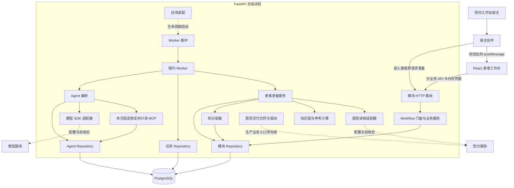

# 架构与代码地图

本文对应 2026-10-10 整理后的实际代码。后端按业务模块分组，模块内区分 HTTP 合同、业务用例与数据访问；前端按页面和功能组织。完成度见 [产品状态](status.md)，时序见 [业务流程](workflows.md)。

## 实际目录层级

```text
.
├── backend/
│   ├── src/chemo_agent_product/
│   │   ├── entrypoints/              # 应用装配、迁移与表单布局维护命令
│   │   ├── core/                     # 配置、认证、公共合同、幂等/审计、安全日志和 HTTP 支持
│   │   ├── modules/
│   │   │   ├── clinical_context/      # 患者进入、刷新、范围与快照
│   │   │   ├── regimen/               # 标准方案、固定版本与完整表单目录
│   │   │   ├── recommendation/        # 后台准备、匹配、候选与查看/比较
│   │   │   ├── patient_regimen/       # 选用、编译、参考计算、修订与确认
│   │   │   ├── knowledge/             # 适用关系、规则、证据与固定模板投影
│   │   │   └── management/            # 授权知识和运行概览
│   │   ├── agent_runtime/             # Agent 任务、绑定、策略与租约 Worker
│   │   │   ├── supervision.py         # Worker 循环恢复、关闭与存活状态
│   │   │   ├── tools/                 # 只读工具分派、范围校验和调用留痕
│   │   │   └── prompts/               # 主 Agent / Reviewer 运行提示词
│   │   ├── integrations/
│   │   │   ├── hospital/              # 医院读取、传输、交付合同与驱动
│   │   │   └── model/                 # Claude Agent SDK 适配
│   │   └── persistence/               # 连接池、JSON 编解码、内部写入和能力检查
│   ├── migrations/                   # 产品增量迁移 SQL
│   └── tests/
│       ├── unit/                     # 规则、计算、合同、认证与 SDK 隔离测试
│       ├── integration/              # PostgreSQL 读取和回滚工作流测试
│       ├── architecture/             # 分层和模拟端依赖边界
│       └── e2e/                      # 浏览器验收宿主与回滚合同替身
├── frontend/
│   ├── src/
│   │   ├── app/                      # 应用外壳、页面切换与宿主接入
│   │   ├── pages/
│   │   │   ├── catalog/              # 方案目录页面与 useCatalog
│   │   │   ├── workstation/          # 患者准备、候选、比较与选用
│   │   │   └── management/           # 知识/运行概览
│   │   ├── features/
│   │   │   ├── patient-regimen/      # 编辑、完整表单、字段和冲突合并
│   │   │   └── agents/               # Agent / Reviewer 状态和产物
│   │   ├── components/               # 共享图标、标签和失败状态
│   │   ├── api/                      # HTTP 客户端与分业务请求
│   │   ├── types/                    # 共享数据合同
│   │   ├── integrations/             # 宿主消息校验和内存凭据
│   │   └── styles/                   # 全局样式；业务 CSS 与功能同目录
│   ├── public/                       # 工作站挂件
│   └── tests/unit/                   # 宿主、挂件、字段、冲突和依赖边界
├── docs/                             # 当前指南；archive/ 保留历史
├── README.md                         # 产品入口和总体导航
└── AGENTS.md                         # AI 协作与工程约束
```

以上为已有代码的实际位置，不预建未实现业务的空模块。缓存、`.env`、构建输出和私有验收产物不属于版本化产品源码。

## 后端层级和依赖方向

典型调用为 `HTTP 路由 → 业务用例 → 本模块 repository → PostgreSQL`。医院和模型协议通过 `integrations/` 适配；匹配、计算和表单编译使用纯业务代码。

| 层 | 负责什么 | 必须保持的边界 |
| --- | --- | --- |
| entrypoints | 生命周期、连接池、路由和 Worker 装配；显式维护命令 | 启动 API 不改表、不导入患者、不发布知识 |
| api / schemas | HTTP 路径、校验、认证依赖和数据合同 | 路由不包含 SQL，也不实现保存事务 |
| service | 权限范围、业务状态、固定版本、幂等与用例执行 | 决定事务范围，持有连接并传给 repository |
| repository | 参数化 SQL、实体读取与写入 | 沿用调用方连接，不自行提交或另开事务 |
| 纯业务文件 | 匹配、计算、字段编译和绑定工具的数据处理 | 不依赖 FastAPI、数据库、HTTP 客户端或模型 SDK |
| integrations | 医院/模型协议与应用数据之间的适配 | 不代替医生确认、规则匹配或候选排序 |
| persistence | 连接池、编解码和通用内部写入 | 不承载患者业务状态机 |

[Workflow](../backend/src/chemo_agent_product/modules/clinical_context/workflow.py) 是应用门面，组合上下文、候选、患者方案和公共命令服务。实际用例在各自模块中执行；保存、确认、幂等回执和审计继续使用原有连接与事务范围。

## 运行组件



仍然是一个 FastAPI 后端，Worker 由 API 生命周期启动；目录调整没有将它变成独立部署进程。任务保存在 PostgreSQL，通过租约领取、续租和恢复，未新增消息队列、ORM 或微服务。医院交付驱动存在，普通患者 API 仍仅提供本地准备检查。

看护器对领取、执行结果写回等导致的循环异常及意外返回采用有上限的退避重启；正常进程关闭传递取消，不重新启动。续租更新为零或续租抛错时取消在途执行，保留数据库时钟租约恢复及原有围栏，旧执行者不写回新持有者状态。

[安全日志](../backend/src/chemo_agent_product/core/observability.py)使用标准库 logging、ContextVar、字段/事件白名单和轮转文件；[请求中间件](../backend/src/chemo_agent_product/core/request_logging.py)只记录路由模板、服务端请求 ID、内部上下文 ID、状态和耗时。异常仅输出类型、产品代码位置和 SQLSTATE，不输出异常正文、局部变量、源码或 SQL 参数。SDK stderr 转为限量诊断类别和计数；框架/SDK 的任意自由文本也在输出前移除。业务审计继续独立落库。

`/health/live` 检查进程，`/health/ready` 在两秒超时内只读探测数据库并检查必要 Worker 的存活/恢复状态；它不证明模型、院方或临床发布已验收。看护器不是操作系统进程守护器；API 进程退出仍由部署环境管理。

## 业务模块与代码入口

| 产品功能 | 主要入口 |
| --- | --- |
| 应用装配、能力状态 | [entrypoints/api.py](../backend/src/chemo_agent_product/entrypoints/api.py)、[core/api.py](../backend/src/chemo_agent_product/core/api.py) |
| 身份、幂等回执与审计 | [security.py](../backend/src/chemo_agent_product/core/security.py)、[commands.py](../backend/src/chemo_agent_product/core/commands.py) |
| 患者进入、刷新与范围 | [clinical_context/service.py](../backend/src/chemo_agent_product/modules/clinical_context/service.py) |
| 医院取数、固定快照与候选准备 | [preparation.py](../backend/src/chemo_agent_product/modules/recommendation/preparation.py) |
| 确定性匹配、候选读取与查看/对比 | [matching.py](../backend/src/chemo_agent_product/modules/recommendation/matching.py)、[recommendation/service.py](../backend/src/chemo_agent_product/modules/recommendation/service.py) |
| 固定方案和完整表单目录 | [regimen/reader.py](../backend/src/chemo_agent_product/modules/regimen/reader.py) |
| 适用关系、规则、证据与投影 | [knowledge/service.py](../backend/src/chemo_agent_product/modules/knowledge/service.py) |
| 选用、修订、历史与确认 | [patient_regimen/service.py](../backend/src/chemo_agent_product/modules/patient_regimen/service.py) |
| 表单编译、参考计算与交付准备 | [compiler.py](../backend/src/chemo_agent_product/modules/patient_regimen/compiler.py)、[calculations.py](../backend/src/chemo_agent_product/modules/patient_regimen/calculations.py)、[readiness.py](../backend/src/chemo_agent_product/modules/patient_regimen/readiness.py) |
| 任务调度、租约和恢复 | [agent_runtime/worker.py](../backend/src/chemo_agent_product/agent_runtime/worker.py) |
| Agent 编排、绑定、工具与引用验证 | [service.py](../backend/src/chemo_agent_product/agent_runtime/service.py)、[bindings.py](../backend/src/chemo_agent_product/agent_runtime/bindings.py)、[tools/service.py](../backend/src/chemo_agent_product/agent_runtime/tools/service.py)、[policy.py](../backend/src/chemo_agent_product/agent_runtime/policy.py) |
| 模型与医院协议 | [model/claude.py](../backend/src/chemo_agent_product/integrations/model/claude.py)、[hospital/reader.py](../backend/src/chemo_agent_product/integrations/hospital/reader.py)、[hospital/delivery.py](../backend/src/chemo_agent_product/integrations/hospital/delivery.py) |
| 授权知识和运行概览 | [management/service.py](../backend/src/chemo_agent_product/modules/management/service.py) |
| 数据库迁移和原表单维护 | [migrate.py](../backend/src/chemo_agent_product/entrypoints/migrate.py)、[word_layout.py](../backend/src/chemo_agent_product/entrypoints/word_layout.py) |

## 前端模块与代码入口

| 功能 | 主要入口 |
| --- | --- |
| 应用外壳与页面切换 | [app/App.tsx](../frontend/src/app/App.tsx) |
| 目录、分页、详情与证据抽屉 | [CatalogPage.tsx](../frontend/src/pages/catalog/CatalogPage.tsx)、[useCatalog.ts](../frontend/src/pages/catalog/useCatalog.ts) |
| 准备状态、候选、比较与选用 | [ClinicalWorkbench.tsx](../frontend/src/pages/workstation/ClinicalWorkbench.tsx) |
| 编辑、保存、历史、确认与冲突 | [PatientEditor.tsx](../frontend/src/features/patient-regimen/PatientEditor.tsx)、[editor-conflict.ts](../frontend/src/features/patient-regimen/editor-conflict.ts) |
| 完整表单和字段绑定 | [BlueprintDocument.tsx](../frontend/src/features/patient-regimen/BlueprintDocument.tsx)、[blueprint-fields.ts](../frontend/src/features/patient-regimen/blueprint-fields.ts) |
| Agent / Reviewer 状态与产物 | [AgentPanel.tsx](../frontend/src/features/agents/AgentPanel.tsx) |
| 知识和运行概览 | [ManagementPage.tsx](../frontend/src/pages/management/ManagementPage.tsx) |
| 宿主通信和挂件 | [host.ts](../frontend/src/integrations/host.ts)、[chemo-widget.js](../frontend/public/chemo-widget.js) |
| 分业务 API 和数据合同 | [api/](../frontend/src/api/)、[types/contracts.ts](../frontend/src/types/contracts.ts) |

页面通过分业务 API 调用后端，`api/client.ts` 统一网络错误、内存 Token 与幂等键。`useCatalog` 管目录状态、取消和重试，页面负责渲染。业务组件、逻辑和 CSS 保持邻近，公共组件放在 `components/`。

## 数据、模拟端和执行边界

- 公共模板/证据版本与患者实例/修订分开，编辑不直接修改公共模板。
- 决策固定患者快照和知识清单；刷新代次后，旧任务和迟到响应不能覆盖当前患者。
- 保存追加不可变修订；确认绑定确切修订与哈希；重新保存需要重新确认。
- 范围、幂等、租约和事务边界必须一起保留。
- Agent 只读取本次绑定数据，不执行 SQL、医生确认或医院写操作。
- 参考计算依赖来源、单位、有效期和公式门禁，实际剂量由受控编辑处理。
- 正式源码和前端构建不包含模拟应用、患者预设值、模拟交付面板或 `/demo` 代理。历史模拟代码、数据、启动配置和验收由独立工作目录及分支维护，本次未同步修改独立版本。
- `tests/e2e/` 的读取替身只用于隔离事务验收，退出回滚，不属于产品运行模块。数据库账号/服务隔离现状见 [产品状态](status.md)。

## 修改定位与验证

| 修改行为 | 首先进入 | 同步验证和文档 |
| --- | --- | --- |
| 患者进入、切换和刷新 | clinical_context、宿主和挂件 | 幂等、范围、代次和租约；workflows |
| 匹配、等级和计算 | recommendation、knowledge、patient_regimen/calculations | 来源、发布门禁、计算边界；workflows、status |
| 编辑、保存和确认 | patient_regimen、前端 patient-regimen | 冲突、历史、确切修订；data-model |
| Agent 或知识检索 | agent_runtime、integrations/model | 工具范围、固定引用、结构化输出；integrations |
| 医院接入 | integrations/hospital、准备/交付用例 | 字段、身份、超时与回执；integrations |
| 表结构和配置 | 新迁移、core/config、persistence | 隔离数据库、校验和；development |

[架构边界测试](../backend/tests/architecture/test_boundaries.py)防止 SQL 回到业务/路由、纯规则依赖外部 IO 和模拟模块进入产品包；[前端边界测试](../frontend/tests/unit/architecture.test.ts)防止页面硬编码业务接口及模拟依赖。

向量知识库与产品 Skill 尚未实现，入口见 [知识检索与扩展位置](integrations.md#知识检索与扩展位置)。目录整改不代表新增临床能力或真实外部服务已联通。
