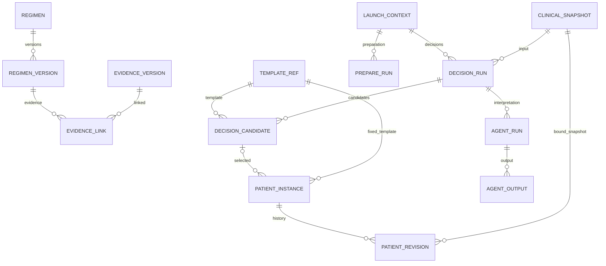

# 数据模型

本文解释实际 schema、核心实体和版本关系。基线数据统计只维护在 [产品状态](status.md)。字段与约束以目标数据库和已执行迁移为准；本仓库的增量 SQL 不构成全部基础建库脚本。

## Schema 职责

| Schema | 职责 | 主要实体 |
| --- | --- | --- |
| `regimen_catalog` | 公共方案、药品、固定版本与表单蓝图 | `regimen`、`regimen_version`、`regimen_medication_item`、`form_blueprint`、`field_definition` |
| `knowledge` | 来源、证据版本、方案关联、等级映射、适用关系与规则审核 | `source_document_version`、`evidence_record_version`、`regimen_evidence_link`、`regimen_applicability_version`、`rule_package_version`、`review_event` |
| `catalog_bridge` | 公共方案向医院业务运行的固定模板引用及独立布局资产 | `template_version_reference`、`form_layout_asset` |
| `clinical` | 医院患者引用、准备、来源、快照、决策、实例、修订和医生动作 | `launch_context`、`prepare_run`、`clinical_snapshot`、`decision_run`、`decision_candidate`、`patient_regimen_instance`、`patient_regimen_revision` |
| `agent` | 模型配置版本、运行、工具调用和结构化产物 | `agent_profile_version`、`agent_run`、`agent_tool_call`、`agent_output` |
| `integration` | 医院、调用尝试、字典映射、校验、交付、归档和状态事件 | `hospital`、`hospital_call_attempt`、`code_mapping_version`、`handover_batch`、`handover_line`、`archive_record` |
| `ops` | 任务、命令回执、审计与产品迁移 | `job`、`command_receipt`、`audit_event`、`product_migration` |

表存在不等于对应生产流程已经实现。医院交付和审核管理能力边界见 [产品状态](status.md)。

## 核心关联

下图是核心引用示意，省略人员、来源、字典、部分复合外键和循环指针。标识符对应下面的实际表名；详细唯一约束需查实库。

| 图中实体 | 实际表 |
| --- | --- |
| REGIMEN / REGIMEN_VERSION | `regimen_catalog.regimen` / `regimen_catalog.regimen_version` |
| EVIDENCE_VERSION / EVIDENCE_LINK | `knowledge.evidence_record_version` / `knowledge.regimen_evidence_link` |
| TEMPLATE_REF | `catalog_bridge.template_version_reference` |
| LAUNCH_CONTEXT / PREPARE_RUN | `clinical.launch_context` / `clinical.prepare_run` |
| CLINICAL_SNAPSHOT | `clinical.clinical_snapshot` |
| DECISION_RUN / DECISION_CANDIDATE | `clinical.decision_run` / `clinical.decision_candidate` |
| PATIENT_INSTANCE / PATIENT_REVISION | `clinical.patient_regimen_instance` / `clinical.patient_regimen_revision` |
| AGENT_RUN / AGENT_OUTPUT | `agent.agent_run` / `agent.agent_output` |

模板引用保存公共版本的固定投影，由程序校验其版本和内容；不能把图中的模板实体等同于可随时改写的公共模板。

## 身份与上下文

`patient_reference`、`encounter_reference`、`staff_reference` 保存医院范围内的引用。外部患者/就诊编码与数据库内部 UUID 分开处理，不根据姓名建立权限或关联。

`launch_context` 绑定医院、患者、就诊、操作者、科室、会话范围和 TTL。`host_generation` 对应宿主患者切换顺序；`active_generation` 对应内部准备代次；`current_prepare_run_id` 指向本次有效准备。

部分外键同时包含医院、患者、就诊或实例 ID，数据库层也校验归属。API 仍须进行授权检查，不能仅凭 UUID 或存在外键就开放读取。

## 快照与知识版本

`source_record`、`snapshot_source` 保留原始来源及快照关联。`clinical_snapshot` 保存规范化患者事实、来源和内容哈希。模型从病历提出的候选文本事实不自动覆盖接口中的已确认事实。

`decision_run` 绑定上下文、准备运行、快照、执行合同、知识清单及清单哈希。`decision_candidate` 保存固定模板引用、证据引用、排序分组、展示区域、等级、独立提示和 X 依据。

知识状态、项目等级、适用关系和来源原始等级是不同字段。DRAFT 不因测试读取或界面隐藏而成为已发布；未关联证据也不自动代表临床不适用。

## 修订与确认

`patient_regimen_instance` 维护当前修订与当前已确认修订指针，并记录医院、患者、就诊、固定模板及来源上下文。

每次保存新增 `patient_regimen_revision`，包含修订号、基准修订、固定快照、保存命令、治疗安排、选择清单、人员快照、编译状态、医嘱哈希、内容哈希和修改原因。字段与药物行存于 `patient_regimen_field_value`、`patient_regimen_order_item`。

确认记录保存在 `doctor_action_event`，绑定确切修订与内容。它不是对修订内容的覆盖，也不是医院已接收回执。实例的 `current_confirmed_revision_id` 必须指向本实例修订。

保存并发控制使用实例 `row_version`；历史修订不随新版模板、新快照或前端重新打开而重算。重新保存后清除当前确认指针，医生需确认新的确切修订。

## 任务、幂等与审计

- `ops.job` 保存任务类型、排队时间、尝试次数、租约拥有者、令牌、代次和有效期；Worker 使用 `FOR UPDATE SKIP LOCKED` 领取任务。
- Worker 提交前验证租约令牌、代次和有效期；任务时钟使用数据库时钟，防止进程时间偏差改变领取行为。
- `ops.command_receipt` 保存幂等命令、输入哈希和结果摘要。相同键不同内容拒绝执行。
- `integration.hospital_call_attempt` 保存实际传输状态和请求/响应引用；认证头不作为业务证据存储。
- `agent_run`、`agent_tool_call`、`agent_output` 分别记录运行、工具执行及结构化产物；模型私有推理不作为页面输出。
- `ops.audit_event` 关联业务动作；普通日志不能代替确定的业务事件和外部回执。

## 迁移与初始化范围

当前产品迁移目录为 [backend/migrations](../backend/migrations/)，包含患者流程基础、独立修订复核和宿主代次三项增量迁移。迁移执行历史及校验和位于 `ops.product_migration`。

基础目录、知识和业务 schema 来源于前置建库资料，尚未完整纳入本仓库的空库初始化流程。获取开发数据库、备份和执行迁移的要求见 [开发指南](development.md#数据库前提与迁移)。已执行 SQL 不可改写；结构修正追加新迁移，历史数据和版本不删除。
