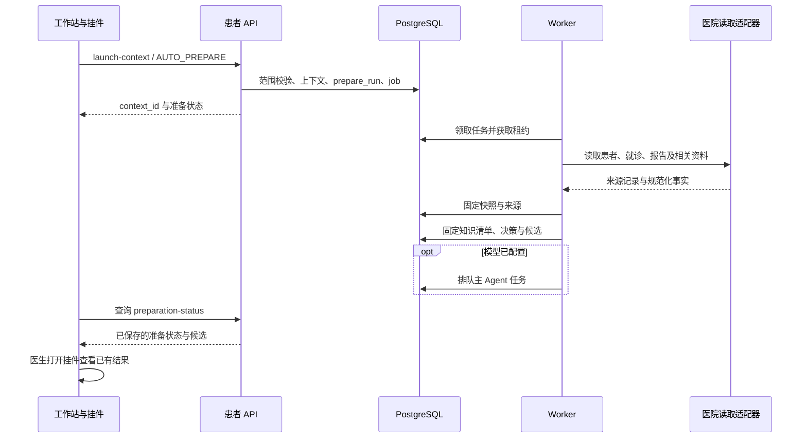

# 业务流程与状态

本文描述当前实现的业务机制。功能与真实接入状态见 [产品状态](status.md)，外部合同见 [集成合同](integrations.md)。

## 患者进入与后台准备

患者进入或切换即启动准备，挂件是否展开不影响准备触发。打开挂件读取既有 context，不重新执行一次患者准备。

进入合同包含患者、就诊、人员、科室、会话及宿主代次。后端检查身份范围和幂等键，切换时将旧上下文标为失效；Worker 在取数、匹配和提交结果前核验当前代次及租约。

刷新使用期望代次并创建新的准备运行；新快照不能悄悄替换旧修订引用的快照。前端更换患者时卸载旧主体、清除内存凭据，并拒绝旧请求的迟到响应。

| 状态对象 | 主要状态 | 含义 |
| --- | --- | --- |
| 上下文 | `ACTIVE`、`SUPERSEDED`；TTL 校验 | 是否仍属于当前患者会话，过期访问被拒绝 |
| 准备运行 | `QUEUED`、`RUNNING`、`SUCCEEDED`、`FAILED`、`SUPERSEDED` | 准备生命周期；重试行为由任务层管理 |
| 准备阶段 | `FETCHING`、`MATCHING`、`READY` | 当前执行步骤，与生命周期分开 |
| 决策运行 | `SUCCEEDED` 及实际失败状态 | 确定性结果的持久化状态 |
| 任务 | `QUEUED`、`RUNNING`、`RETRY_WAIT`、`SUCCEEDED`、`FAILED`、`CANCELLED`、`DEAD_LETTER` | 排队、租约、重试及最终失败 |

准确枚举和约束以数据库及合同为准；表中不把状态展示文案当作数据库枚举。

## 固定候选与匹配

Worker 装载当前癌种相关的固定方案、适用关系、规则及证据清单，再由 `matching.assess` 形成候选。候选结果分别存储：

| 字段 | 表达内容 |
| --- | --- |
| `presentation_region` | 推荐展示区或 X 区 |
| `evidence_level`、`evidence_grade` | 项目配置的依据等级 |
| `evidence_state` | 已核验、测试参考或缺少批准依据 |
| `data_labels` | 缺失、过期、冲突或未配置范围 |
| `safety_labels` | 普通风险提示 |
| `x_reason_code`、`x_basis` | 明确 X 理由及其来源 |

FDA/DAILYMED 对应 5、CSCO 对应 7，I-A 为当前项目配置；保留来源原始等级。同等级使用方案编码等稳定键排序，不赋予额外临床优先级。普通风险、缺项、分期和线次不作为隐含重排权重。

只有配置中的适应症外关系或具备完整来源的明确绝对禁忌可进入 X；无关癌种不展示。未发布知识不能进入正式临床决策。测试模式的癌种目录回退和待核验证据有单独标识，具体可用情况见 [产品状态](status.md)。

## 查看、选用、保存与确认

| 操作 | 数据影响 |
| --- | --- |
| 公共目录查看 | 读取公共固定版本，不建立患者方案 |
| 查看或比较候选 | 校验当前候选范围并记录动作；最多比较三份，不选用方案 |
| 选用候选 | 建立患者方案实例，绑定候选、模板引用和来源上下文 |
| 编辑 | 区分医院来源、程序计算和医生可编辑字段；未保存修改保留在前端 |
| 保存 | 追加不可变修订、字段值、药物行、来源、哈希和修改原因；更新实例指针 |
| 确认 | 校验当前修订 ID、哈希、行版本和提示确认；记录医生确认事件 |
| 医院交付 | 独立的外部业务动作；普通产品 API 尚未开放生产提交 |

保存使用 `expected_row_version` 和可选的 `base_revision_id`。并发变化时保留本地编辑并进行三方合并；不会静默覆盖另一个修订。保存后实例的当前确认指针被清除，需确认新修订。

确认当前限定为内部测试合同。保存与确认的版本关系见 [数据模型](data-model.md#修订与确认)。

## 主 Agent 与独立 Reviewer

- 准备完成且模型已配置后，主 Agent 排队；医生也可主动请求解释。
- Reviewer 可手动检查已保存的确切修订；医生确认后，API 请求一次异步独立复核。
- Reviewer 失败或未配置会返回实际状态，不撤销已记录的医生确认。保存本身不默认触发自动 Reviewer。
- 主 Agent 解释固定候选及依据，Reviewer 记录问题、来源和待核对事项；两者不改写患者方案、等级或确认状态。
- 产物需要符合结构化合同并引用本次运行允许的来源；不展示模型私有思维链。

提示词与工具合同见 [模型与只读 MCP](integrations.md#模型与只读-mcp)。

## 院方交付目标与当前边界

合同目标顺序为：预校验 → 导入受理 → 查询医嘱处理结果 → 归档 → 查询签名。撤销是另一操作，受批次状态约束；受理、全部成功、部分成功、归档与签名分别处理。

当前产品实现了请求/响应合同、HTTP 驱动与已确认修订的本地准备检查。生产提交状态机、全类别医嘱编译和真实医院联通仍待完成。本地模拟版本使用固定场景及持久回执，其成功不能作为真实医院业务证明。

写请求超时代表外部结果未知，按原记录回查；不能自动创建新批次重复提交。部分成功不得显示为全部成功；归档或签名的返回必须匹配原记录和文书。

## 失败与恢复原则

| 情况 | 处理方式 |
| --- | --- |
| 医院读取或模型未配置 | 返回明确不可用状态，保留实际失败记录 |
| 来源缺失、过期、冲突、单位不明 | 提示核对，相关参考计算不猜补 |
| 患者切换或旧任务失去租约 | 拒绝旧上下文和旧执行者提交结果 |
| 相同幂等键、相同载荷 | 复用已有命令结果 |
| 相同幂等键、不同载荷 | 返回冲突，不覆盖已执行命令 |
| 保存并发冲突 | 保留修改，读取当前修订并合并 |
| 医院写结果未知 | 使用原记录回查，禁止盲目重发 |

代码入口：[Workflow](../backend/src/chemo_agent_product/modules/clinical_context/workflow.py)、[Worker](../backend/src/chemo_agent_product/agent_runtime/worker.py)、[患者 API](../backend/src/chemo_agent_product/modules/patient_regimen/api.py)。
